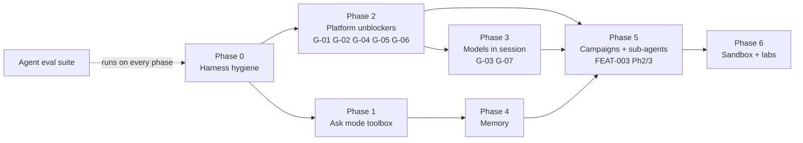

# BS-007 / 07 — Build order

Status: draft. Ordered by what unblocks the most agent value per unit of work. The tools
can only expose what the platform can do, so platform fixes (G-xx, from 01 §10) appear
alongside agent work.

| Phase | Deliverables | Why now | Done when |
|---|---|---|---|
| **0 Harness hygiene** | Prompt caching in `crates/llm`; dual-channel tool results; `ResearchState` + rolling summary; generic jobs + `wait_for_jobs`; structured `final_report`; SSE streaming; steering messages; resume on restart; eval-suite skeleton with synthetic instruments | Cheapest large gains in cost, reliability and UX; every later phase builds on them | A 2-hour session's context stays flat; a restart resumes; the noise suite runs |
| **1 Ask-mode toolbox** | `describe_returns`, `volatility_report`, `regime_report` (features only), `event_study`, `liquidity_cost_report`, `get_live_snapshot`, `get_data_coverage`, `correlation_report`, `seasonality_report`; L1 concept cards + `search_knowledge`; Ask mode UI | Immediate daily value; needs no Set J changes; pure Rust compute over ClickHouse bars | Q&A suite accuracy target met at ≤ 60k tokens per answer |
| **2 Platform unblockers** | One feature library for backtest/train/serve (G-01, G-02); exit actions + position state (G-04); percent/risk/model sizing in sim (G-05); honour cost model, seed, strategy version (G-06); verify fill timing (G-14) | Expands the reachable archetype space from 2 to ~8 (06 Part D) | Archetype table rows turn ✅; `CostSweep` members differ |
| **3 Models in session** | AI nodes in backtests via PIT batch inference, with a Gate 0 check that the model's training window predates the run window (G-03); `create_dataset`, `start_training`, `evaluate_model`, `compare_models`, `predict`; meta-labeling builder; windowed sequence models (G-10); GARCH conditional serving | Delivers "train a model and use it in an algo" honestly | A meta-labelled strategy completes the funnel end to end |
| **4 Memory** | Findings + hypotheses in Postgres; Milvus collections for L1/L2; local embedding model option; `search_research_memory`; instrument profiles (L3) + `find_analog_periods` | Stops repeated work across sessions | A second session on the same instrument cites prior findings and skips rejected hypotheses |
| **5 Campaigns + sub-agents** | FEAT-003 Phase 2 (campaign, islands, moves, de-dup, bandit) and Phase 3 (regime engine); Critic/Author/Analyst sub-agents; model routing | Autonomy at scale, now that the space and memory exist | FEAT-003 Phase 2 acceptance criteria |
| **6 Sandbox + labs** | `run_notebook` (D3); process library + `ProcessNull`; scenario Greeks; Kalshi pricing lab; options IV/Greeks; signature features; effective-N DSR, SPA/Romano–Wolf | Long tail and advanced math, once the foundations are honest | Each lab ships with a benchmark it must beat |

**Separate track (not agent work, but blocks J8 and deployment):** wire live strategy
evaluation (hot-path stage 3 loading, `InstanceManager::dispatch`, inference refresh), G-11.
