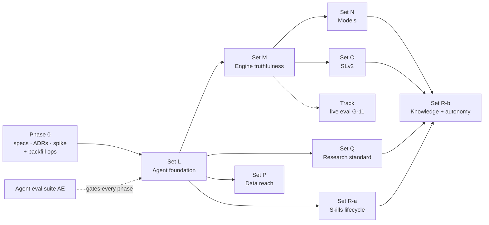

# BS-007 / 17 — Build order: phases, plan sets, ADRs

**Status:** spec-ready draft. Maps every spec doc to a formal spec, an ADR and a plan set,
so each plan set can be written as `docs/plans/plan-sets/set-<X>/MASTER.md` plus phase
files, like Sets J and K.

---

## 1. Phase 0: contracts (design only, plus one spike and one ops task)

**Formal specs to write** (in `docs/Specs/`), derived from the BS-007 docs:

| Formal spec | From | Notes |
|---|---|---|
| AGENT-001 Agent runtime and harness | 02, 03, 04 | Supersedes the internal-agent part of ADR-0022 and FEAT-003 §harness |
| AGENT-002 Agent toolbox (`tbot` SDK/CLI, MCP) | 14 | Supersedes the INTG-001 tool list |
| AGENT-003 Knowledge, memory and skills | 12, 13 | — |
| AGENT-004 Agent evaluation suite | 16 | — |
| COMP-005 Job service and artifact store | 05 | — |
| COMP-006 Research workspace UI | 15 | Coordinates with the Set K unified workspace |
| DATA-005 Data API v2 and sources | 06 | — |
| DATA-006 Unified feature engine | 07 | — |
| FEAT-004 Strategy representation v2 (plus DATA-004 v2 AST) | 08 | — |
| FEAT-005 Backtest engine integration (FEAT-002 update) | 09 | — |
| FEAT-006 Model platform v2 (AI_MODELS_SUITE update) | 10 | — |
| BACKTEST_SUITE_CORE_SPEC v2 | 11 | Extends Set J |

**ADRs to write** (in `docs/adr/`, next free number 0024):

| ADR | Decision |
|---|---|
| 0024 | Agent runtime = Claude Agent SDK in a per-project container; LLM proxy for keys, budgets and telemetry (D-02, D-07) |
| 0025 | Enforcement at platform services: research cutoff, Desk project, token scopes, report validator (D-10) |
| 0026 | Two-layer strategy representation (D-08) |
| 0027 | Free-only data sources (D-09) |
| 0028 | Skill registry, platform-side admission, glossary-as-view (D-06) |
| 0029 | Single feature engine with PyO3 bindings |
| 0030 | Durable job service and content-addressed artifact store |

**Runtime spike** (1–2 weeks, throwaway allowed):
- Agent SDK (Python) in a rootless container, calling the model through a minimal LLM
  proxy;
- `tbot data bars` with the cutoff enforced;
- `tbot jobs submit/wait` for a backtest;
- a validated `final_report`;
- the pure-noise eval task end to end.

The spike answers 03 §17 questions 1–3 and verifies the SDK option names used in 03 and 04.

**Ops task, start immediately:** deep history backfill (06 §6, S1). Every later phase
needs years of bars.

**Reconcile Set K first.** Parts of Set K shipped with FEAT-003 Phase 1 (the real
`SimRunExecutor`). Fold the remaining K items into L and M: Postgres/ClickHouse stores,
parallel execution, and the unified workspace.

## 2. Phases and plan sets

| Phase | Plan set | Scope (requirement IDs) | Exit criteria |
|---|---|---|---|
| **1 Agent foundation** | **L** | RT-01…RT-21 · CX-01…CX-14 · JB-01…JB-12 · DA-01…DA-09, DA-13, DA-15 · TB §3.1–3.3, §3.9 (read), §3.10 · UI-01…UI-05, UI-07, UI-08 · AE-01…AE-05 (skeleton) · SK-01, SK-09 with static core skills · KM-01 · EV-02, EV-10 | 03 §16, 04 §12 items 1–4, 05 §9, 06 §10 items 1, 2 and 5, 16 §10 item 1 |
| **2 Engine truthfulness** | **M** | FE-01…FE-09 · BT-01…BT-11 · ST-01…ST-04 (Layer 1) · TB §3.4, §3.5 (Layer 1 items), §3.6 | 07 §8, 09 §10, 08 §10 item 1; archetype space no longer limited to EMA/RSI |
| **2–3 Research standard** (parallel with M) | **Q** | EV-01, EV-03…EV-08 · 11 §8 High tools · AE auditor suite (§3) | 11 §10 items 1–4; 16 §10 item 2 |
| **3 Models** | **N** | MD-01…MD-13 · TB §3.7 · analysis fit-process and regime models | 10 §9 |
| **4 Strategy Language v2** | **O** | ST-05…ST-12 · UI-09 | 08 §10 items 2–4 |
| **4 Skills lifecycle** | **R-a** | SK-02…SK-08, SK-10, SK-12…SK-15 (registry, materialiser, propose, verify, project admission) · UI-06 | 13 §12 items 1, 2 and 4 |
| **5 Data reach** | **P** | DA-10…DA-12, S1–S7 · TB §3.2 (phase 5), §3.8 · quarantined reader (RT-13) | 06 §10 items 3–4 |
| **6 Knowledge and autonomy** | **R-b** | KM-02…KM-10 · SK-11, SK-16, SK-17 (promotion, curator, A/B) · EV-09 (random arm) · FEAT-003 Phases 2–3 (campaigns, regime engine) inside the new harness · research/R1 techniques (tree search, move memory, playbook, Swiss tournaments, sleep-time) | 12 §11, 13 §12 items 3 and 5, 11 §10 item 5 |
| **Track** | (own set) | Live strategy evaluation wiring (G-11) → EV-11 forward gate · paper-deployment proposals · J8 monitoring | Paper fills reconcile with backtest distributions |

## 3. Dependencies

## 4. Rules for writing the plan sets

- Every task cites the requirement IDs it satisfies. A plan set is done when all its IDs
  meet their spec's acceptance criteria.
- Phases are build order, not feature-gating. Each spec is designed at full fidelity
  (the Set J convention).
- The eval suite (16) gates every phase exit. Efficiency changes pass non-inferiority
  (04 §10).
- Keep the invariants in 00 (INV-1/2/3, P1) and D-10 through every phase.
- Cargo builds on the dev box: use `-j 2` (build-env memory note).

## 5. Risks

| Risk | Mitigation |
|---|---|
| Scope: this re-platforms several services | Contracts first (Phase 0); keep engines and Set J; phase exits gated by the eval suite |
| A sandboxed agent bypasses honesty rules | Enforcement at data, evaluation, token and admission layers (03 §2), not prompts |
| Sandbox security on a Windows/Docker/WSL dev box | Rootless containers, egress allowlist, no secrets (LLM proxy); Docker phantom-socket runbook |
| Harness lock-in to the Agent SDK (D-07) | Capabilities live behind the platform API, SDK and MCP; the harness is replaceable without touching services |
| Frontier-model cost on long runs | 04 techniques, budgets at the proxy, dollars-per-verdict tracking; no capability cuts (D-11) |
| Layer 1 strategies drift from deployable ones | Mandatory reconciliation before promotion (08 §7) |
| Self-made skills degrade the agent, leak alpha or carry injections | Experience-only triggers, platform-side verification, quant tests, ~40 resident cap, human review for global (13) |
| Free-only data limits depth (D-09) | Backfill now (S1); forward-collect options and L2; state data limits in every report (B-08) |
| Thin history makes CPCV and regime work unreliable | Backfill before Set M exit; `data_qc` grades gate Experiments |

## 6. Retirement checkpoints

| When | Retire |
|---|---|
| End of L | `crates/api/src/agent/{driver,prompt}.rs` run loop; `/agent` page; `wait_for_backtest`; the draft-builder MCP tools |
| End of M | `features.py` feature computation; `features_compute.rs`; stateless `evaluate_signals` backtest path |
| End of O | v1 JSON authoring as the primary format (translator stays) |
